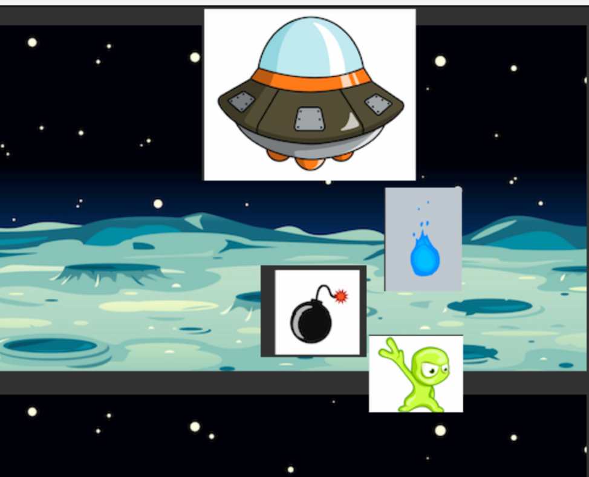

# Team Hackathon Project - Game

## Team Name

**Firebirds**

## Team Members

* [Harshada Baswaraj Jivane](https://github.com/harshadajiv) - 013855751
* [Mayura Dhivya Nehruji](https://github.com/MayuraDhivyaNehruji) - 012434461
* [Prathamesh Karve](https://github.com/prathamr) - 013850928
* [Sonia Mannan](https://github.com/) - 
* [Sheethal Mathew](https://github.com/) - 

## Project Name
### Astral Alpha

## Platform
### Greenfoot

## Participants

1. Bazooka – Protagonist - Attacks the aliens
2. Fire and lazer beam – Bazooka's weapons
3. Aliens (3 Types- Orange,Red and Yellow)- Enemies
4. Explosive - Aliens Weapons

## Functionality
1. The initial screen will have Play and Help buttons.
2. Help displays some basic instructions about the game.
3. On clicking Play, the Bazooka is constantly moving to the right side of the screen, trying to avoid the attacks from aliens    and destroying them with fire/laser attacks.
4. The aliens are constantly throwing explosives.
5. There will be a background sound that starts as soon as player clicks on Play and whenever the player or aliens are attacking, there will be a sound of blast.
6. There is a “Health” attribute of spaceship that reduces if the spaceship is attacked by aliens. The game stops when Health == 0
7. There is a “Score” attribute that increases when spaceship attacks the aliens. When player reaches score more than 100, the background changes to show another planet. When player reaches more than 200, player wins.
8. In the end, a screen displays the final score of the user.

## UI Mock screen

## Individual Contributions
1. Sheethal Mathew

2. Sonia Mannan

3. Prathamesh Karve

4. Mayura Dhivya Nehruji

5. Harshada Baswaraj Jivane

## Project Task Board:
https://github.com/nguyensjsu/fa19-202-firebirds/projects/1

## Sprint Task Sheet:

Sprint(Screenshot) 

Burndown (Screenshot)

https://github.com/nguyensjsu/fa19-202-firebirds/blob/master/SprintTaskSheet.xlsx

## Daily Standup
https://github.com/nguyensjsu/fa19-202-firebirds/tree/master/StandUpScreenshots

## Retrospective
https://github.com/nguyensjsu/fa19-202-firebirds/tree/master/Retrospective

## UML Diagrams

Use Case Diagram

Sequence Diagram for the Attack Scenario

Activity Diagram

Command Pattern

Factory Pattern

Decorator Pattern

## Design Pattern Notes
https://github.com/nguyensjsu/fa19-202-firebirds/tree/master/DesignPatternNotes.md

## Sprint Meeting Report

**Week 1**

https://github.com/nguyensjsu/fa19-202-firebirds/tree/master/WeeklyReport/Week-1

**Week 2**

https://github.com/nguyensjsu/fa19-202-firebirds/tree/master/WeeklyReport/Week-2

## Ad Video
https://youtu.be/iBuHcXx70g8

## Game Demo
URL
