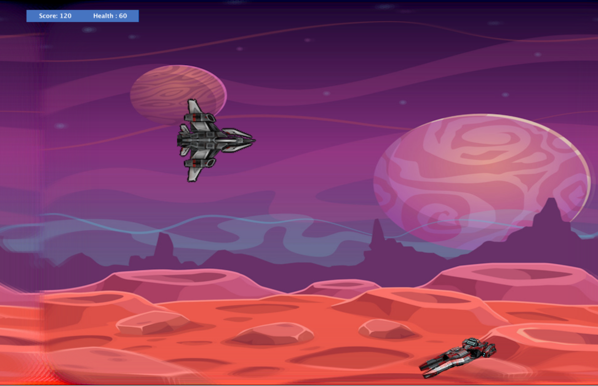
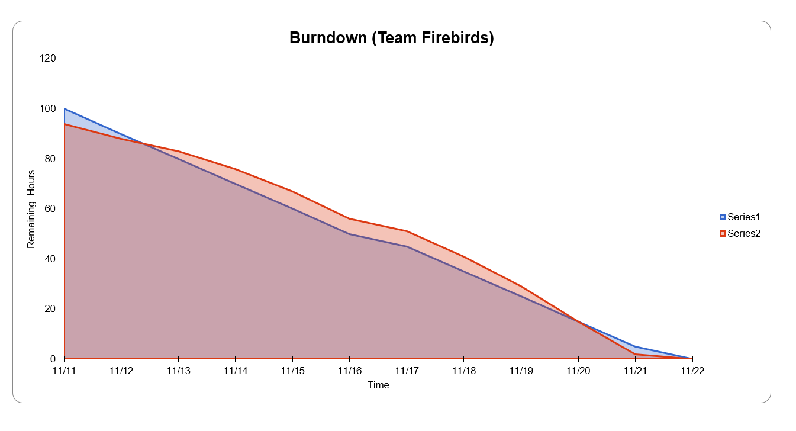

# Team Hackathon Project - Game

## Team Name

**Firebirds**

## Team Members

* [Harshada Baswaraj Jivane](https://github.com/harshadajiv) - 013855751
* [Mayura Dhivya Nehruji](https://github.com/MayuraDhivyaNehruji) - 012434461
* [Prathamesh Karve](https://github.com/prathamr) - 013850928
* [Sonia Mannan](https://github.com/) - 009009117
* [Sheethal Mathew](https://github.com/) - 009558393

## Project Name
### Astral Alpha

## Platform
### Greenfoot

## Participants

1. Bazooka – Protagonist - Attacks the aliens
2. Fire and lazer beam – Bazooka's weapons
3. Aliens (3 Types- Orange,Red and Yellow)- Enemies
4. Explosive - Aliens Weapons

## Functionality
1. The initial screen will have Play and Help buttons.
2. Help displays some basic instructions about the game.
3. On clicking Play, the Bazooka is constantly moving to the right side of the screen, trying to avoid the attacks from aliens    and destroying them with fire/laser attacks.
4. The aliens are constantly throwing explosives.
5. There will be a background sound that starts as soon as player clicks on Play and whenever the player or aliens are attacking, there will be a sound of blast.
6. There is a “Health” attribute of spaceship that reduces if the spaceship is attacked by aliens. The game stops when Health == 0
7. There is a “Score” attribute that increases when spaceship attacks the aliens. When player reaches score more than 100, the background changes to show another planet. When player reaches more than 200, player wins.
8. In the end, a screen displays the final score of the user.

## UI Mock screen

## GAME NAVIGATION

Gaming Points

Menu Page of Game

Help Page

Level 1

During the level 1

Level 2

When gamer wins

When gamer loses

## Individual Contributions
1. **Sheethal Mathew**

A. Refined Requirement

B. Sprint Task Sheet for Sprints

C. Helped with Help Button

D. UI images

E. Testing

F. Worked on Blast classes

2. **Sonia Mannan**

A. Implemented Bazooka and weapons feature

B. Implemented Alien spawning feature

C. Implemented score feature

D. Implemented end game message feature

E. Requirements and testing

3. **Prathamesh Karve**

A. Implemented Level Strategy Pattern

B. Added design notes for Observer and Strategy pattern

C. Added class diagrams for Observer and Strategy pattern

D. Helped in maintaining readme documentation

E. Added sounds for the game and ad video

F. Implemented different types of aliens

4. **Mayura Dhivya Nehruji**

A. UI revamp  from the initial mockup.

B: Blocker addressed: Opaque image

C. Added Sound Effects for the game.

D. Videos of the sprint retrospective and stand up meeting

E. Helped with the health feature of the pilot.

F. Worked on Counter Class

G.Testing

5. **Harshada Baswaraj Jivane**

A. Designed Requirement Document and reviewed with the team.

B. Setting up git README on git with class diagrams for factory,Decorator and Command Pattern.

C. Ideation of user story video and Worked on user story video with team.

D. Designed classes and interfaces for alien explosives and Game's MyWorld(Entry)

E. Designed classes for Command Pattern (Help).

F. Implemented Help feature and Alien Explosives using Factory Pattern.

G. Designed Activity and sequence diagram for the game.

H. Tested overall game features.

## Project Task Board:
https://github.com/nguyensjsu/fa19-202-firebirds/projects/1

## Sprint Task Sheet:

Sprint(Screenshot) 

Burndown (Screenshot)

## Daily Standup Video
https://github.com/nguyensjsu/fa19-202-firebirds/tree/master/StandUpScreenshots

## Retrospective Video
https://github.com/nguyensjsu/fa19-202-firebirds/tree/master/Retrospective

## UML Diagrams

**Command Pattern Class Diagram**

**Observer Pattern Class Diagram**

**Factory Pattern Class Diagram**

**Decorator Pattern Class Diagram**

**Strategy Pattern Class Diagram**

**Use Case Diagram**

**Game's Sequence Diagram**

**Sequence Diagram for the Attack Scenario**

**Activity Diagram**

## Design Pattern Notes
https://github.com/nguyensjsu/fa19-202-firebirds/tree/master/DesignPatternNotes.md

## Testcases

https://github.com/nguyensjsu/fa19-202-firebirds/testcases.docx

## Sprint Meeting Report

**Week 1**

https://github.com/nguyensjsu/fa19-202-firebirds/tree/master/WeeklyReport/Week-1

**Week 2**

https://github.com/nguyensjsu/fa19-202-firebirds/tree/master/WeeklyReport/Week-2

## Ad Video
https://youtu.be/iBuHcXx70g8

## Retrospective Video

https://youtu.be/QojuksmWwpU

## StandUp Video

https://youtu.be/Eqgmjsja1lI
## Game Demo
URL
