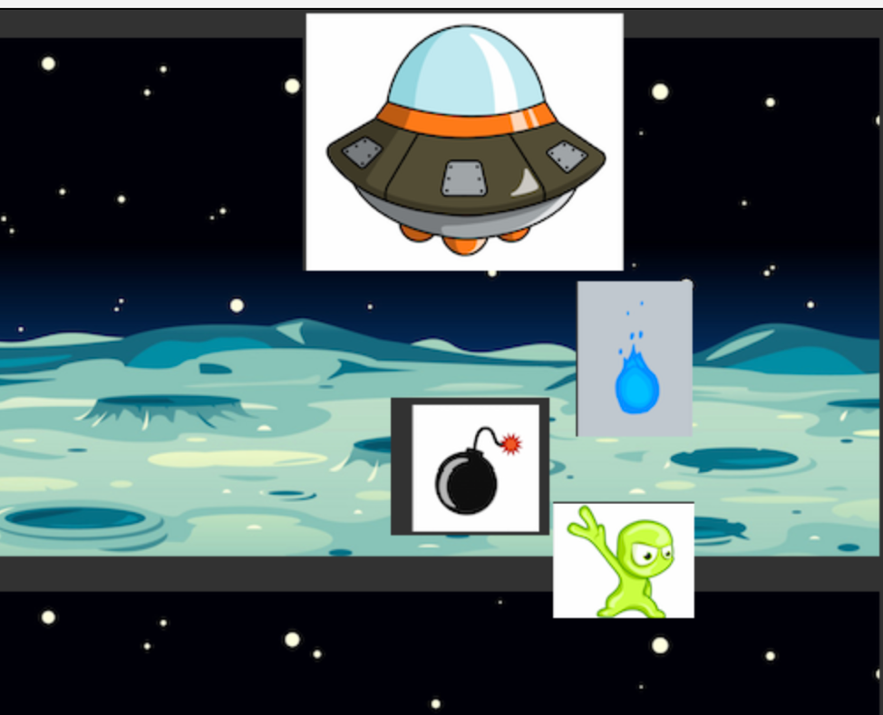

<h2>CMPE 202 Project</h2>

<h1>Astral Alpha</h1>

<h3>Purpose</h3>

Time to attack the aliens before they attack us

<h3>Platform</h3>

Greenfoot

<h3>Participants</h3>

1.	Bazooka – Attacks the aliens
2.	Fire and lazer beam – Bazooka's weapons
3.	Aliens (3 Types- Orange,Red and Yellow)- Enemies
4.	Explosive - Aliens Weapons

<h3>Functionality</h3>

1.	The initial screen will have Play and Help buttons.
2.	Help displays some basic instructions about the game.
3.	On clicking Play, the spaceship is constantly moving to the right side of the screen, trying to avoid the attacks from aliens and destroying them with fire/water attacks.
4.	The aliens are constantly throwing two kinds of explosives.
5.	There will be a background sound that starts as soon as player clicks on Play and whenever the player or aliens are attacking, there will be a sound of blast.
6.	There is a “Health” attribute of spaceship that reduces if the spaceship is attacked by aliens. The game stops when Health == 0
7.	There is a “Score” attribute that increases when spaceship attacks the aliens. When player reaches score 100, the background changes to show another planet. When player reaches 200, player wins. 
8.	In the end, a screen displays the final score of the user.

Following picture is just a basic sample of participants of the game – 

